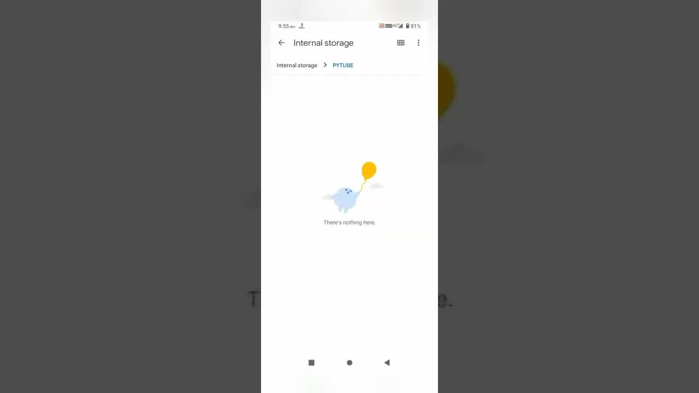

# download-any-youtube-video-using-python-｜-convert-youtube-video-to-mp3-(song)-using-pydroid3-python

  <picture>
    
  </picture>

 

---

## Video Information

| Property | Value |
|----------|-------|
| **Video Name** | `download-any-youtube-video-using-python-｜-convert-youtube-video-to-mp3-(song)-using-pydroid3-python` |
| **Original Link** | [YouTube Video](https://youtube.com/shorts/9bwNoiZ4oIM?si=YNGXcmnqAWnDN41r) |
| **Total Size** | **1 file** - **1.32 MB** |
| **Quality** | **720** |
| **Status** | **Complete (100%)** |
| **Password Protected** | **NO** |

---

## Download Links

| # | File | Link |
|---|------|------|
| 1 | `download-any-youtube-video-using-python-｜-convert-youtube-video-to-mp3-(song)-using-pydroid3-python.mp4` | [Download](https://raw.githubusercontent.com/sagaliga-a11y/Ourtube_forked/main/videos/download-any-youtube-video-using-python-%EF%BD%9C-convert-youtube-video-to-mp3-%28song%29-using-pydroid3-python/download-any-youtube-video-using-python-%EF%BD%9C-convert-youtube-video-to-mp3-%28song%29-using-pydroid3-python.mp4) |

---

## How to Extract

Ready to use — no extraction needed!

---

*This tool created by [avasam.ir](https://avasam.ir)*
